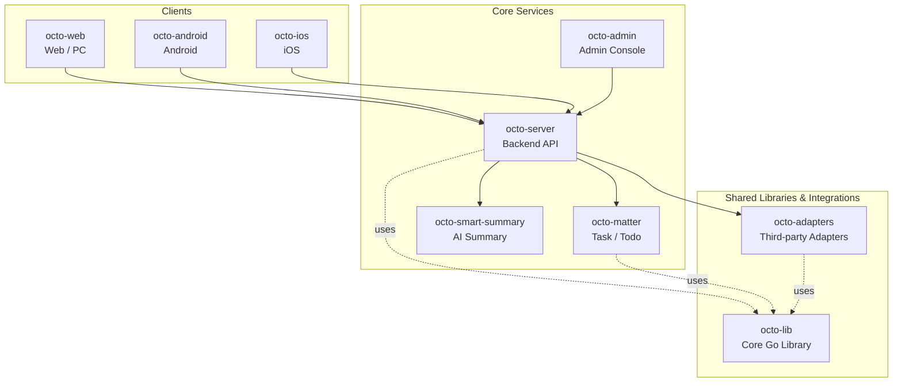

<p align="center">
  <sub>🔄</sub>
</p>

<p align="center">
  <b>Octo Version Sync — the upstream version aggregator for OCTO.</b><br/>
  <sub>Polls GitHub Releases and npm every few minutes, writes a normalized <code>version.json</code> to object storage so daemons everywhere see one truth.</sub>
</p>

<p align="center">
  <a href="https://github.com/Mininglamp-OSS"><b>🏠 OCTO Home</b></a> ·
  <a href="#-quickstart"><b>🚀 Quickstart</b></a> ·
  <a href="#-octo-ecosystem"><b>📦 Ecosystem</b></a> ·
  <a href="https://github.com/Mininglamp-OSS/octo-server/blob/main/CONTRIBUTING.md"><b>🤝 Contributing</b></a>
</p>

<p align="center">
  <a href="./LICENSE"></a>
  <a href="./README.zh.md"></a>
  
  
</p>

---

> 🌐 **Read in**: **English** · [简体中文](README.zh.md)

# 🔄 Octo Version Sync

> **Upstream version aggregator** for the OCTO platform. Periodically scans GitHub Releases + npm registry, emits a single normalized `version.json` consumed by [`octo-server`](https://github.com/Mininglamp-OSS/octo-server) to drive daemon and plugin remote upgrades.

`octo-version-sync` is the source-of-truth for "what is the latest
version of each component in the OCTO fleet". It runs as a long-lived
Kubernetes Deployment, scans configured upstreams (GitHub Releases for
Go binaries, npm registry for OpenClaw plugins) on a configurable
interval, normalises every release's tag, assets and checksums into a
single JSON file, and writes that file to Tencent Cloud COS for any
downstream service to pull.

## 🌟 Why a separate version aggregator

- **Decoupled from the API server.** Polling cadence, retries, and rate-limit handling for GitHub / npm don't live in the request path. `octo-server` consumes a static JSON; it doesn't talk to external version registries directly.
- **One canonical shape.** Wildly different release schemas (semver tags, calendar versions, `rust-v*` prefixes, asset name conventions) are normalised into one consistent envelope — `{latest_version, release_meta.assets[], release_meta.checksums{}}` — that downstream code never has to special-case.
- **Survives upstream outages.** When a GitHub Release lookup fails, the component is flagged `status=stale` but the previous good data is preserved. Total upstream blackout never overwrites COS with garbage.

## 🚀 Quickstart

### Local run

```bash
go build -o bin/octo-version-sync ./main.go

# Write to local files (default ./output/version.json)
./bin/octo-version-sync --store=file --interval=1m

# With GitHub token (recommended to bypass rate limits)
./bin/octo-version-sync --store=file --interval=1m --github-token=ghp_xxx

# Custom component list
./bin/octo-version-sync --store=file --components=./components.json
```

Inspect the output:

```bash
cat output/version.json | python3 -m json.tool
```

### Production (COS + K8s)

The shipped `manifests/deploy.yaml` is the production template (used
by the GitLab CI `deploy` stage and rendered into the deploy-files
repo for ArgoCD). It expects a Kubernetes Secret
`octo-version-sync-secrets-<env>` carrying:

| Key | Purpose |
|---|---|
| `cos-bucket-url` | Tencent COS bucket URL |
| `cos-secret-id` / `cos-secret-key` | COS credentials |
| `github-token` | GitHub Releases API token (recommended) |
| `trigger-token` | Bearer token for the `/trigger` endpoint |

Force an immediate scan (not waiting for the interval):

```bash
curl -XPOST \
  -H "Authorization: Bearer $TRIGGER_TOKEN" \
  https://<pod>/trigger
```

## 📦 Tracked components

Default component set (see `components.json`):

| Component | Source | What it powers |
|---|---|---|
| `octo-daemon` | `github:Mininglamp-OSS/octo-daemon-cli` | The OCTO runtime monitor daemon |
| `claude` | `github:anthropics/claude-code` | Claude Code CLI |
| `codex` | `github:openai/codex` | OpenAI Codex CLI |
| `hermes` | `github:NousResearch/hermes-agent` | Hermes Agent |
| `openclaw` | `npm:openclaw` | OpenClaw runtime (npm) |
| `openclaw-channel-dmwork` | `npm:openclaw-channel-dmwork` | OpenClaw channel plugin (legacy npm name; the rebranded plugin lives at `clawhub:octo`) |

Add a component by editing `components.json` — the next scan cycle
picks it up automatically (no redeploy needed).

## 🧬 How it works

1. **Component loop** — iterate every component in `components.json` (or the hardcoded `DefaultComponents` fallback).
2. **Source dispatch** — `github:owner/repo` → GitHub Releases API; `npm:package-name` → npm registry.
3. **Version extraction** — regex `(\d+\.\d+\.\d+)` over the release name (preferred) or tag, falling back across `v0.3.0` / `rust-v0.128.0` / `2026.4.30` / `release-1.2.3` shapes.
4. **Asset classification** — for GitHub releases, asset filenames are parsed for `os` (darwin/linux/windows), `arch` (arm64/amd64/386), and `kind` (archive/installer/checksum/signature).
5. **Reconcile** — components removed from `components.json` get pruned from the JSON output.
6. **Failure mode** — single component fetch failure → keep prior data, set `status=stale`. Total failure → skip the COS write to protect the last-good snapshot.
7. **Output write** — `version.json` is written atomically to COS (or local file in dev mode). Time stamps use Asia/Shanghai wall-clock without timezone suffix for direct UI rendering.

## 🗂 Output shape

```jsonc
{
  "updated_at": "2026-05-18T17:30:00",
  "components": {
    "octo-daemon": {
      "latest_version": "0.3.0",
      "release_meta": {
        "tag": "v0.3.0",
        "assets": [
          {"name": "octo-daemon-darwin-arm64.tar.gz", "url": "...", "os": "darwin", "arch": "arm64", "kind": "archive", "size": 2827327}
        ],
        "checksums": {"octo-daemon-darwin-arm64.tar.gz": "sha256:e87cb7..."}
      },
      "fetched_at": "2026-05-18T17:30:00",
      "source": "github:Mininglamp-OSS/octo-daemon-cli",
      "status": "ok"
    }
  }
}
```

## 🛠 Build from source

```bash
git clone https://github.com/Mininglamp-OSS/octo-version-sync.git
cd octo-version-sync
make build
```

Container image (production uses `tencentcloudcr.com`-hosted Go +
Alpine base):

```bash
docker build -t octo-version-sync:dev .
```

## 🔗 OCTO Ecosystem

<!-- shared snippet: OCTO repo matrix. Keep identical across all 9 repos. -->



| Repository | Language | Role |
|---|---|---|
| [`octo-server`](https://github.com/Mininglamp-OSS/octo-server) | Go | Backend API · business orchestration · Lobster agent scheduling |
| [`octo-matter`](https://github.com/Mininglamp-OSS/octo-matter) | Go | Task / Todo / Matter micro-service |
| [`octo-smart-summary`](https://github.com/Mininglamp-OSS/octo-smart-summary) | Go | LLM-powered conversation summarisation |
| [`octo-web`](https://github.com/Mininglamp-OSS/octo-web) | TypeScript / React | Web & PC (Electron) client |
| [`octo-android`](https://github.com/Mininglamp-OSS/octo-android) | Kotlin / Java | Native Android client |
| [`octo-ios`](https://github.com/Mininglamp-OSS/octo-ios) | Swift / Objective-C | Native iOS client |
| [`octo-admin`](https://github.com/Mininglamp-OSS/octo-admin) | TypeScript / React | Admin console (tenant / org / user / channel management) |
| [`octo-lib`](https://github.com/Mininglamp-OSS/octo-lib) | Go | Shared core library (protocol, crypto, storage, HTTP) |
| [`octo-adapters`](https://github.com/Mininglamp-OSS/octo-adapters) | TypeScript / Python | Third-party integrations (IM bridges, AI channels) |

## 🤝 Contributing

`octo-version-sync` follows the OCTO platform-wide contribution
workflow. Please read the shared guidelines in the
[`octo-server`](https://github.com/Mininglamp-OSS/octo-server)
repository:

- [CONTRIBUTING.md](https://github.com/Mininglamp-OSS/octo-server/blob/main/CONTRIBUTING.md)
- [CODE_OF_CONDUCT.md](https://github.com/Mininglamp-OSS/octo-server/blob/main/CODE_OF_CONDUCT.md)
- [SECURITY.md](https://github.com/Mininglamp-OSS/octo-server/blob/main/SECURITY.md) — please follow this for security disclosures instead of the public tracker.

## 📄 License

Apache License 2.0 — see [LICENSE](LICENSE) for the full text and
[NOTICE](NOTICE) for third-party attributions.

---

<p align="center">
  <sub>Made with 🐙 by <b>OCTO Contributors</b> · <a href="https://github.com/Mininglamp-OSS">Mininglamp-OSS</a></sub>
</p>
