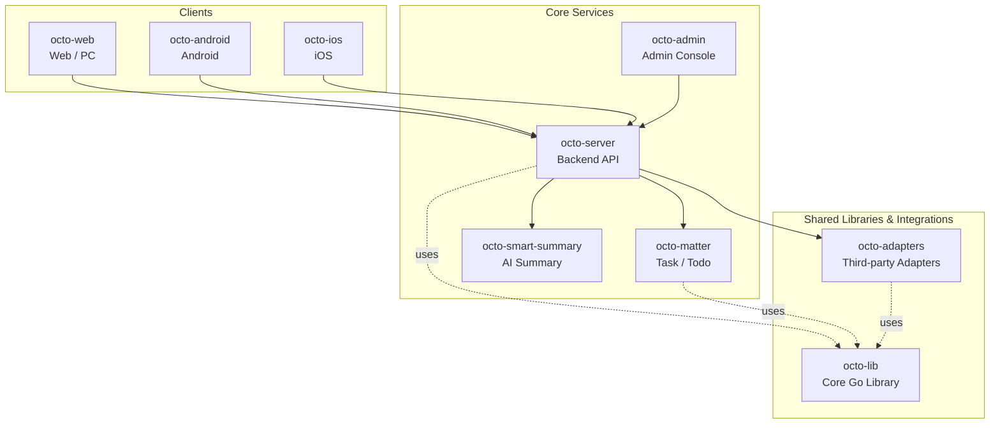

<p align="center">
  <sub>🔄</sub>
</p>

<p align="center">
  <b>Octo Version Sync —— OCTO 平台的上游版本聚合服务。</b><br/>
  <sub>每隔几分钟扫描 GitHub Releases 和 npm，把标准化的 <code>version.json</code> 写到对象存储，让全网 daemon 共享同一份真相。</sub>
</p>

<p align="center">
  <a href="https://github.com/Mininglamp-OSS"><b>🏠 OCTO 主页</b></a> ·
  <a href="#-快速开始"><b>🚀 快速开始</b></a> ·
  <a href="#-octo-生态"><b>📦 生态</b></a> ·
  <a href="https://github.com/Mininglamp-OSS/octo-server/blob/main/CONTRIBUTING.zh.md"><b>🤝 贡献</b></a>
</p>

<p align="center">
  <a href="./LICENSE"></a>
  <a href="./README.md"></a>
  
  
</p>

---

> 🌐 **语言**: [English](README.md) · **简体中文**

# 🔄 Octo Version Sync（简体中文）

> **OCTO 平台的上游版本聚合服务**。定时扫 GitHub Releases + npm registry，输出唯一的标准化 `version.json`，由 [`octo-server`](https://github.com/Mininglamp-OSS/octo-server) 消费驱动 daemon 与插件远程升级。

`octo-version-sync` 是"OCTO 各组件最新版本是多少"这件事的
single source of truth。它以长期运行的 Kubernetes Deployment 形式
存在，按可配置间隔扫描上游（GitHub Releases 取 Go 二进制、npm
registry 取 OpenClaw 插件），把每个 release 的 tag、assets、checksum
规整成一份统一 JSON，写入腾讯云 COS 供下游服务拉取。

## 🌟 为什么单独搞一个版本聚合服务

- **与 API server 解耦。** 对 GitHub / npm 的轮询节奏、重试、限流处理不放在请求路径里。`octo-server` 只读一份静态 JSON，不直接和外部版本源说话。
- **统一一种形状。** 各家 release 格式差异巨大（semver / 日期版本 / `rust-v*` 前缀 / 千奇百怪的 asset 命名），全部规整成同一个信封 —— `{latest_version, release_meta.assets[], release_meta.checksums{}}` —— 下游代码再也不用 special-case。
- **抗上游故障。** 单组件抓取失败 → 保留旧数据 + 标 `status=stale`；全网失败 → 跳过 COS 写入，绝不用垃圾覆盖上次的好快照。

## 🚀 快速开始

### 本地运行

```bash
go build -o bin/octo-version-sync ./main.go

# 写本地文件（默认 ./output/version.json）
./bin/octo-version-sync --store=file --interval=1m

# 带 GitHub token（推荐，避免限流）
./bin/octo-version-sync --store=file --interval=1m --github-token=ghp_xxx

# 自定义组件列表
./bin/octo-version-sync --store=file --components=./components.json
```

查看输出：

```bash
cat output/version.json | python3 -m json.tool
```

### 生产（COS + K8s）

仓库里的 `manifests/deploy.yaml` 是生产模板（GitLab CI 的 `deploy`
stage 用它渲染进 deploy-files 仓供 ArgoCD 拉取）。运行依赖一个
Kubernetes Secret `octo-version-sync-secrets-<env>`：

| Key | 用途 |
|---|---|
| `cos-bucket-url` | 腾讯云 COS bucket URL |
| `cos-secret-id` / `cos-secret-key` | COS 凭据 |
| `github-token` | GitHub Releases API token（推荐） |
| `trigger-token` | `/trigger` 端点的 Bearer token |

强制立即扫描一次（不等 interval）：

```bash
curl -XPOST \
  -H "Authorization: Bearer $TRIGGER_TOKEN" \
  https://<pod>/trigger
```

## 📦 跟踪组件

默认组件集合（见 `components.json`）：

| 组件 | 来源 | 作用 |
|---|---|---|
| `octo-daemon` | `github:Mininglamp-OSS/octo-daemon-cli` | OCTO Runtime 监控守护进程 |
| `claude` | `github:anthropics/claude-code` | Claude Code CLI |
| `codex` | `github:openai/codex` | OpenAI Codex CLI |
| `hermes` | `github:NousResearch/hermes-agent` | Hermes Agent |
| `openclaw` | `npm:openclaw` | OpenClaw 运行时（npm） |
| `openclaw-channel-octo` | `npm:openclaw-channel-octo` | OpenClaw channel 插件（改名后的版本；同时也发布到 ClawHub 上的 `clawhub:octo`） |

新增组件只需编辑 `components.json` —— 下一轮扫描自动生效，无需重启。

## 🧬 工作原理

1. **组件循环** —— 遍历 `components.json`（或硬编码的 `DefaultComponents` fallback）。
2. **源分发** —— `github:owner/repo` → GitHub Releases API；`npm:package-name` → npm registry。
3. **版本提取** —— 用正则 `(\d+\.\d+\.\d+)` 优先匹配 release name，回退 tag，兼容 `v0.3.0` / `rust-v0.128.0` / `2026.4.30` / `release-1.2.3` 各种格式。
4. **Asset 分类** —— GitHub release 的 asset 文件名按关键字识别 `os`（darwin/linux/windows）、`arch`（arm64/amd64/386）、`kind`（archive/installer/checksum/signature）。
5. **Reconcile** —— `components.json` 里删掉的组件从输出 JSON 中清理掉。
6. **失败模式** —— 单个组件抓取失败 → 保留旧数据 + 标 `status=stale`；全部失败 → 不写 COS，保护上次的好快照。
7. **输出写入** —— `version.json` 原子写到 COS（dev 模式写本地文件）。时间戳用 Asia/Shanghai 墙钟、不带时区后缀，便于前端直接渲染。

## 🗂 输出形状

```jsonc
{
  "updated_at": "2026-05-18T17:30:00",
  "components": {
    "octo-daemon": {
      "latest_version": "0.3.0",
      "release_meta": {
        "tag": "v0.3.0",
        "assets": [
          {"name": "octo-daemon-darwin-arm64.tar.gz", "url": "...", "os": "darwin", "arch": "arm64", "kind": "archive", "size": 2827327}
        ],
        "checksums": {"octo-daemon-darwin-arm64.tar.gz": "sha256:e87cb7..."}
      },
      "fetched_at": "2026-05-18T17:30:00",
      "source": "github:Mininglamp-OSS/octo-daemon-cli",
      "status": "ok"
    }
  }
}
```

## 🛠 从源码构建

```bash
git clone https://github.com/Mininglamp-OSS/octo-version-sync.git
cd octo-version-sync
make build
```

构建容器镜像（生产基于 `tencentcloudcr.com` 镜像源的 Go + Alpine）：

```bash
docker build -t octo-version-sync:dev .
```

## 🔀 仓库拓扑

`octo-version-sync` 同时存在于两个地方，**不是对等关系** —— 一个是
代码来源真相，另一个只是触发 CI/CD 的镜像：

| 仓库 | 角色 | 在这里做什么 |
|---|---|---|
| **`github.com/Mininglamp-OSS/octo-version-sync`** | **Source of truth**（本仓） | 写代码 / 开 PR / review |
| `codex.mlamp.cn/dmwork/octo-version-sync`（GitLab EE） | Pull mirror + CI/CD runner | 看 pipeline 日志 |

GitLab 那侧每 ~5 分钟从 GitHub Pull Mirror 一次，触发
`.gitlab-ci.yml`（TCR 镜像构建 → deploy-files 渲染 → ArgoCD 同步）。
**不要往 GitLab 那侧直接 push** —— 那些 commit 会被下一次 mirror pull
覆盖掉。

为什么拆两边：GitHub 承载代码 + 轻量 PR CI
（`.github/workflows/ci.yml` —— `go build` + `go test`）。完整的
build & deploy 流水线留在 GitLab，因为它依赖的内部基础设施
（TCR namespace / deploy-files 仓 / K8s secrets）都在 VPN 内、跑在
GitLab runner 上。

## 🔗 OCTO 生态

<!-- shared snippet: OCTO repo matrix. Keep identical across all 9 repos. -->



| 仓库 | 语言 | 角色 |
|---|---|---|
| [`octo-server`](https://github.com/Mininglamp-OSS/octo-server) | Go | 后端 API · 业务编排 · Lobster Agent 调度 |
| [`octo-matter`](https://github.com/Mininglamp-OSS/octo-matter) | Go | 任务 / 待办 / Matter 微服务 |
| [`octo-smart-summary`](https://github.com/Mininglamp-OSS/octo-smart-summary) | Go | LLM 驱动的会话摘要 |
| [`octo-web`](https://github.com/Mininglamp-OSS/octo-web) | TypeScript / React | Web 与 PC（Electron）客户端 |
| [`octo-android`](https://github.com/Mininglamp-OSS/octo-android) | Kotlin / Java | 原生 Android 客户端 |
| [`octo-ios`](https://github.com/Mininglamp-OSS/octo-ios) | Swift / Objective-C | 原生 iOS 客户端 |
| [`octo-admin`](https://github.com/Mininglamp-OSS/octo-admin) | TypeScript / React | 管理控制台（租户 / 组织 / 用户 / 频道） |
| [`octo-lib`](https://github.com/Mininglamp-OSS/octo-lib) | Go | 共享核心库（协议、加密、存储、HTTP） |
| [`octo-adapters`](https://github.com/Mininglamp-OSS/octo-adapters) | TypeScript / Python | 第三方集成（IM 桥接、AI channel） |

## 🤝 贡献

`octo-version-sync` 遵循 OCTO 平台级统一贡献流程，详见
[`octo-server`](https://github.com/Mininglamp-OSS/octo-server) 仓库
的共享文档：

- [CONTRIBUTING.zh.md](https://github.com/Mininglamp-OSS/octo-server/blob/main/CONTRIBUTING.zh.md)
- [CODE_OF_CONDUCT.zh.md](https://github.com/Mininglamp-OSS/octo-server/blob/main/CODE_OF_CONDUCT.zh.md)
- [SECURITY.zh.md](https://github.com/Mininglamp-OSS/octo-server/blob/main/SECURITY.zh.md) —— 安全问题请走这里，不要公开提 issue。

## 📄 许可证

Apache License 2.0 —— 完整文本见 [LICENSE](LICENSE)，第三方依赖归属
见 [NOTICE](NOTICE)。

---

<p align="center">
  <sub>Made with 🐙 by <b>OCTO Contributors</b> · <a href="https://github.com/Mininglamp-OSS">Mininglamp-OSS</a></sub>
</p>
